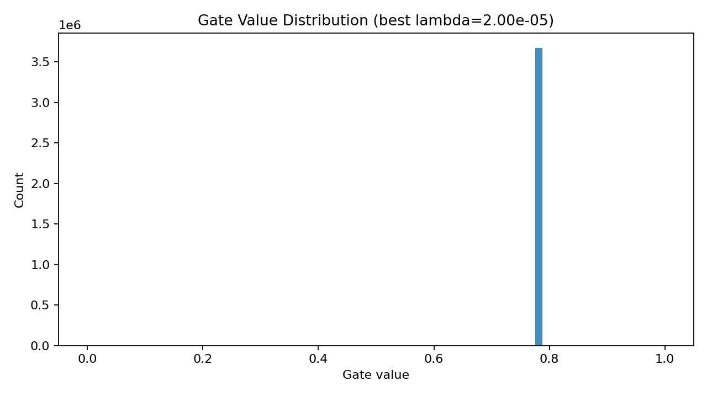

# Self-Pruning Neural Network Report

## Why L1 on Sigmoid Gates Encourages Sparsity
Each gate is defined as `g = sigmoid(s)` and constrained to `[0,1]`. Adding an L1 penalty on these gate values means the optimizer pays a direct cost for every active connection. To reduce the objective, it is incentivized to push many gates toward 0. Once a gate is near zero, the corresponding effective weight `w_eff = w * g` contributes almost nothing to the output, effectively pruning that connection.

## Experiment Summary

| Lambda | Test Accuracy | Sparsity Level (%) |
|---:|---:|---:|
| 1.00e-06 | 40.38% | 0.00% |
| 5.00e-06 | 40.84% | 0.00% |
| 2.00e-05 | 41.86% | 0.00% |

Sparsity threshold used: `0.01`

## Gate Distribution Plot (Best Model)

Best model selected by highest test accuracy, with lambda = `2.00e-05`.

